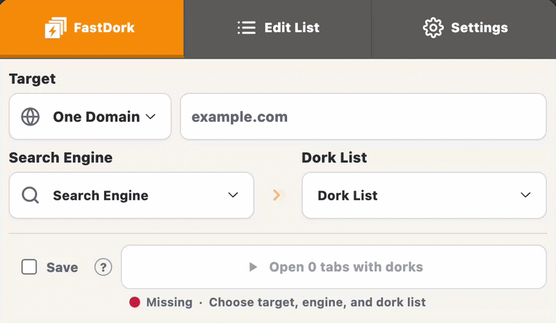
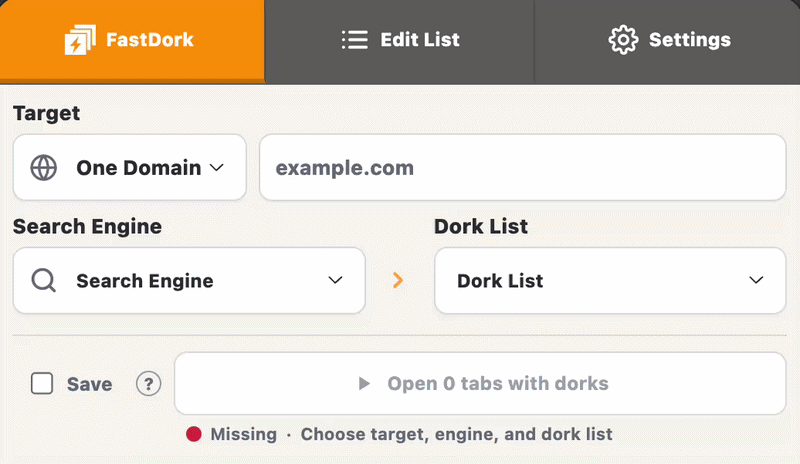
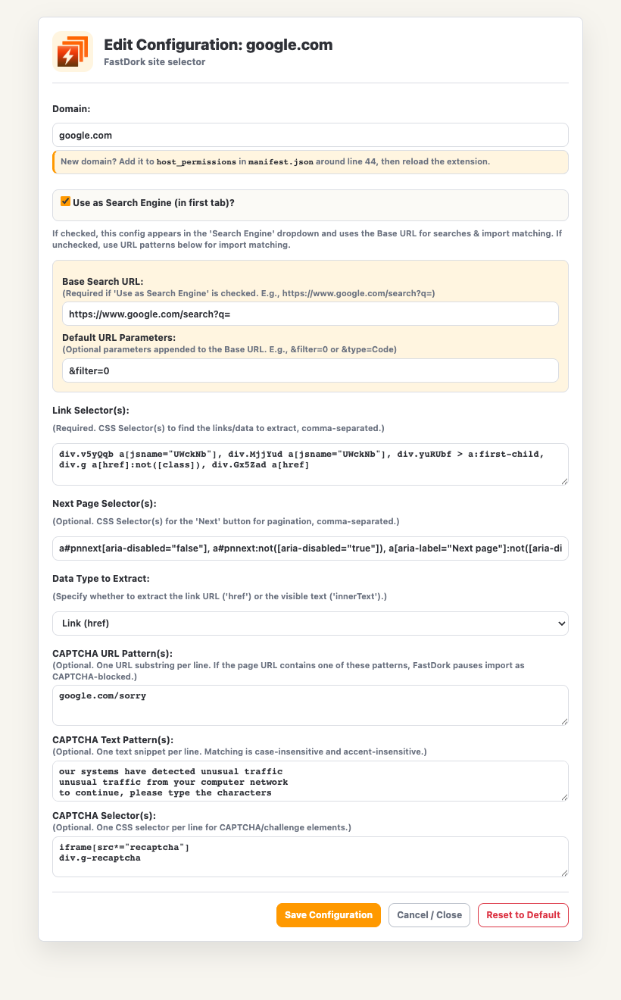

<p align="center">
  <a href="https://github.com/SKVNDR/FastDork">
    
  </a>
</p>

<h1 align="center">FastDork</h1>

<p align="center">
  <b>Save time on dork research and result scraping with reusable lists, bulk search tabs, and one-click imports.</b>
</p>

<p align="center">
  <a href="https://github.com/SKVNDR/FastDork/blob/master/manifest.json"></a>
  &nbsp;
  <a href="https://github.com/SKVNDR/FastDork/blob/master/LICENCE"></a>
  &nbsp;
  <a href="https://github.com/SKVNDR/FastDork/stargazers"></a>
  &nbsp;
  <a href="https://github.com/SKVNDR/FastDork/issues"></a>
</p>

## What FastDork Does

FastDork is built to speed up repetitive dork research and scraping workflows.
Instead of rebuilding queries, opening result pages one by one, and copying links manually, you can prepare reusable lists, launch searches in batches, and import matching results into clean result lists.

You can:

- run many dork queries from one list;
- open the generated searches in multiple tabs;
- scrape or manually import URLs, domains, or text from supported pages;
- save imported data into result lists;
- create custom site configurations with CSS selectors;
- extract JavaScript paths from the current page.

FastDork stores its data locally in your browser using Chrome extension storage.

## Installation

1. Download or clone this repository.
2. Open Chrome and go to `chrome://extensions/`.
3. Enable **Developer mode**.
4. Click **Load unpacked**.
5. Select the FastDork folder that contains `manifest.json`.
6. Pin the FastDork icon if you want quick access.

## Quick Start

1. Open FastDork.
2. Go to the **FastDork** tab.
3. Choose a mode: **One Domain** or **One Dork**.
4. Enter your target or dork template.
5. Choose a search engine.
6. Choose a dork list.
7. Click **Open X tabs with dorks**.

Optional: enable **Auto-Import Results** before launching if you want FastDork to scrape supported result pages and save the data into a result list.

## Demo

### Auto-Import Results



### Manual Import



## List Types

FastDork uses two kinds of lists.

| Type | What it is for |
| --- | --- |
| **Dork List** | Dorks, search queries, payloads, or targets used by the FastDork tab. |
| **Result List** | Imported URLs, domains, JS paths, or extracted text. |

Use a **Dork List** when you want to run searches.
Use a **Result List** when you want to store collected data.

## FastDork Tab

This is the main tab for launching searches.

### Modes

**One Domain**

Use this when you have one target and many dorks.
In this mode, the selected **Dork List** should contain dork templates that use `$target` or `$t`.

Example:

- Target: `example.com`
- Dork list item: `site:$target ext:pdf`
- Resulting query: `site:example.com ext:pdf`

**One Dork**

Use this when you have one dork template and many targets.
In this mode, the selected **Dork List** should contain domains, companies, keywords, or other targets.

Example:

- Dork input: `site:$target intitle:"index of"`
- Dork list item / target: `example.com`
- Resulting query: `site:example.com intitle:"index of"`

You can use `$target` or `$t` as the placeholder.

Quick rule:

- **One Domain**: type one domain, choose a list of dork templates with `$target` or `$t`.
- **One Dork**: type one dork template with `$target` or `$t`, choose a list of domains or targets.

### Run Options

After clicking **Open X tabs with dorks**, FastDork shows a confirmation window.

You can choose:

- delay between opened tabs and auto-import page changes;
- whether to auto-import results;
- which result list should receive imported data.

The status line tells you what is happening, for example:

- `Ready · 14 queries · Bing`
- `Missing · Choose target, engine, and dork list`

## Edit List Tab

Use this tab to edit list contents and import data.

You can:

- select any `Dork:` or `Result:` list;
- edit the textarea content;
- see line numbers;
- see the total line count;
- see the last update date when available;
- clear, paste, copy, and save;
- extract JS paths from the current tab;
- import data from supported pages.

When FastDork detects a supported page, an **Import from...** button appears.

Example:

- open a Bing search results page;
- open FastDork;
- go to **Edit List**;
- choose a result list;
- click **Import from Bing**.

If imported items are already in the list, FastDork avoids duplicates.

## Settings Tab

Use this tab to manage lists and site configurations.

### Keep FastDork Open

Enable **Keep FastDork Open** to open FastDork in Chrome's side panel.

This is useful during manual imports because the side panel can stay visible while the current page changes.
FastDork remembers this switch the next time you open the extension.
If the side panel content looks cropped, drag the panel edge wider.

### Manage Lists

You can:

- create a new list;
- choose whether it is a Dork List or Result List;
- delete existing lists.

### Configure Sites

Site configurations tell FastDork how to extract data from a website.

Each configuration can define:

| Field | Purpose |
| --- | --- |
| **Domain** | The site key, for example `bing.com`. |
| **Use as Search Engine** | Makes the site available in the FastDork tab. |
| **Base URL** | Search URL prefix, for example `https://www.bing.com/search?q=`. |
| **Default Params** | Extra URL parameters added after the query. |
| **Link Selectors** | CSS selectors used to extract links or text. |
| **Next Page Selectors** | CSS selectors used to move to the next results page. |
| **Data Type** | `href` for links, `innerText` for visible text. |
| **Match Patterns** | URL snippets used to decide when the import button should appear. |
| **CAPTCHA URL Patterns** | URL snippets that indicate a CAPTCHA page. |
| **CAPTCHA Text Patterns** | Visible text that indicates a CAPTCHA or human check. |
| **CAPTCHA Selectors** | CSS selectors that indicate CAPTCHA elements. |

Default configs include Google, Bing, DuckDuckGo, GitHub, HackerOne, Bugcrowd, Intigriti, and Exploit-DB.

Example Google configuration:



Example Shodan search engine configuration:

You can also add another search engine, for example `shodan.io`.

| Field | Example |
| --- | --- |
| **Domain** | `shodan.io` |
| **Use as Search Engine** | enabled |
| **Base URL** | `https://www.shodan.io/search?query=` |
| **Default Params** | leave empty unless you need extra URL parameters |
| **Link Selectors** | start with `a[href*="/host/"]`, then adjust with DevTools if Shodan changes its markup |
| **Next Page Selectors** | start with `a[rel="next"]`, then adjust with DevTools if needed |
| **Data Type** | `href` |
| **Match Patterns** | `shodan.io/search` |

Then add Shodan to `host_permissions` in `manifest.json`:

```json
"*://*.shodan.io/*"
```

If you add a site that is not already covered by FastDork, also add its domain to `host_permissions` in `manifest.json`.
In this project, that section starts around line 44.
After editing `manifest.json`, reload the extension in `chrome://extensions/`.

Example:

```json
"host_permissions": [
  "*://*.example.com/*"
]
```

## Auto-Import And Pagination

Auto-import can scrape multiple result pages.

FastDork will:

1. open the generated search tabs;
2. extract matching data from the current page;
3. click or navigate to the next page when a next-page selector exists;
4. wait for the configured delay;
5. continue until there is no next page, no new data, or a CAPTCHA blocks the import.

If a CAPTCHA is detected, FastDork pauses the affected import tab. If other import tabs can continue, they continue. If all remaining imports are blocked by CAPTCHA, FastDork shows a message so you can solve the challenge.

## Common Workflows

### Import Scope, Then Dork It

1. Open a supported program page, such as HackerOne, Bugcrowd, or Intigriti.
2. Go to **Edit List**.
3. Choose or create a **Result List**.
4. Click the **Import from...** button.
5. Go to **FastDork**.
6. Choose a **Dork List**.
7. Use one imported domain as the target.
8. Run the dorks.

### Search For Code Leaks

1. Create a **Dork List** with GitHub queries.
2. Use `$target` in your dorks.
3. Go to **FastDork**.
4. Enter a company name, domain, or keyword as the target.
5. Select GitHub as the engine.
6. Run the searches.

Example dork:

```text
"$target" filename:.env
```

## Security Notes

- Use FastDork only on targets and programs you are authorized to test.
- Lists and settings are stored locally in Chrome extension storage and are not sent to any server by FastDork.
- Custom site configurations can change what the extension extracts.
- Review custom selectors before importing data from unknown pages.
- Review extension permissions before installing any browser extension.

## FAQ

**How many tabs can FastDork open?**

The default limit is 20 tabs.

**Can I add a custom search engine?**

Yes. Go to **Settings** -> **Configure Sites** -> **Add New**, enable **Use as Search Engine**, then add the base URL and selectors.
If the site uses a domain that is not already in FastDork, add it to `host_permissions` in `manifest.json` too, then reload the extension.

**Can I import data from any website?**

Usually yes, if you create a site configuration with the right CSS selectors and match patterns.

**What is the difference between a Dork List and a Result List?**

A **Dork List** is used to run searches.
A **Result List** is used to store imported or collected data.

**Does FastDork sync my data across devices?**

No. Data is stored locally in your browser using Chrome extension storage. FastDork does not send it to any server.

## License

Code released under the [MIT License](LICENCE).

Import functionality was inspired by TomNomNom's webpaste tool.
